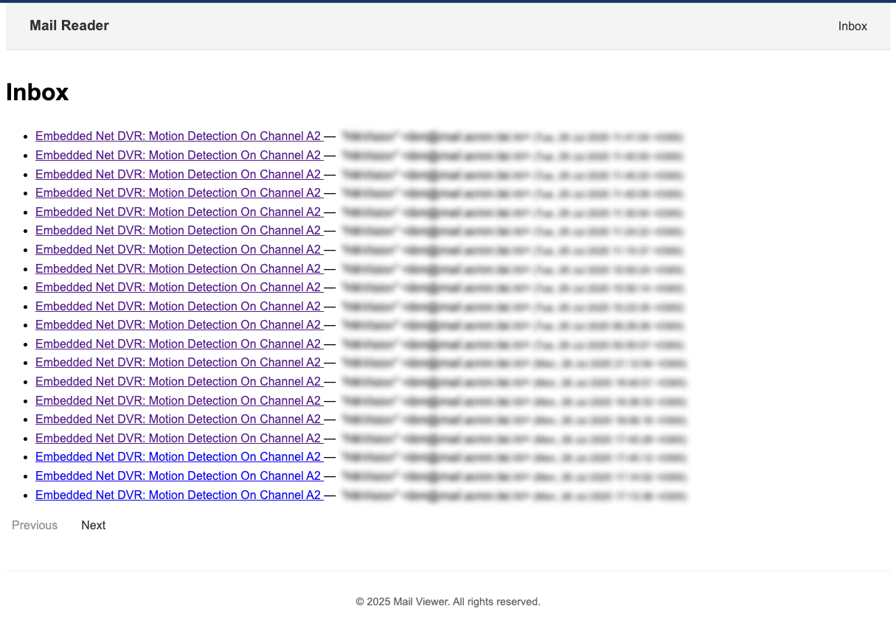
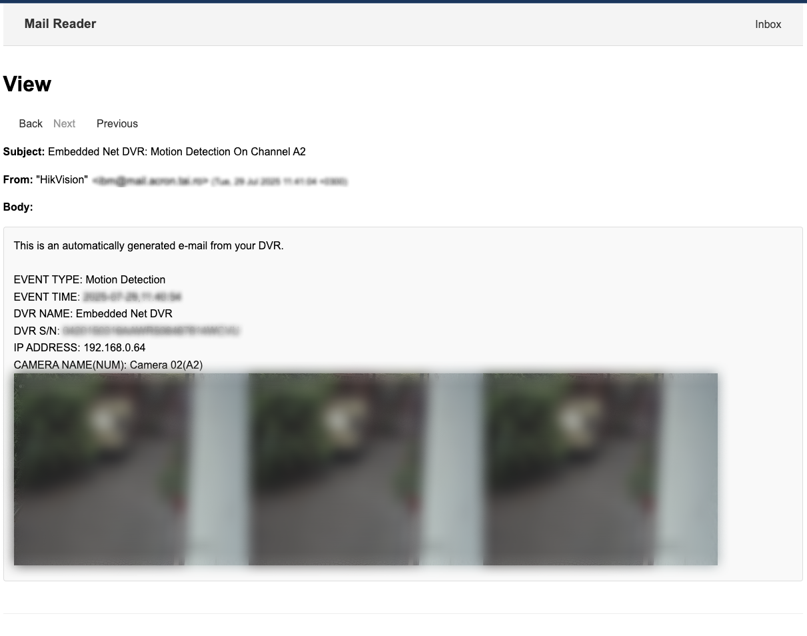

# Maildir Web Viewer

A lightweight web-based interface for viewing and managing email accounts configured with Maildir format. This platform is particularly useful for monitoring system-generated emails, such as security camera motion detection alerts.

## Features

- Web-based interface for viewing Maildir emails
- Automatic cleanup of old emails and attachments
- Simple authentication via htpasswd
- Lightweight and easy to set up

## Prerequisites

- PHP 7.4 or higher
- Composer (PHP package manager)
- Web server (Apache/Nginx) with PHP support
- Maildir-formatted email accounts

## Installation

1. Clone the repository:
   ```bash
   git clone git@github.com:alexacron/maildir-viewer.git
   cd maildir-viewer
   ```

2. Install PHP dependencies:
   ```bash
   composer install
   ```

3. Configure the environment:
   ```bash
   cp .env.dist .env
   ```
   Edit the `.env` file to configure your settings:
   ```
   APP_ENV=prod  # Change to 'prod' for production
   DELETE_MAILS_DAYS=30  # Number of days to keep emails
   ```

4. Set up web server:
   - Point your web server's document root to the `public_html` directory
   - Ensure the web server has read access to the Maildir directories
   - Set up proper file permissions:
     ```bash
     chmod -R 755 public_html
     ```

## Security Setup

It's highly recommended to protect the application with basic authentication. Here's how to set it up with Apache:

1. Create a password file (if you don't have one):
   ```bash
   sudo htpasswd -c /etc/apache2/.htpasswd username
   ```

2. Add the following to your Apache configuration or .htaccess file in the `public_html` directory:
   ```apache
   AuthType Basic
   AuthName "Restricted Access"
   AuthUserFile /etc/apache2/.htpasswd
   Require valid-user
   ```

## Setup Cleanup Cron Job

To automatically clean up old emails, set up a daily cron job:

```bash
# Edit the crontab
crontab -e

# Add this line to run the cleanup daily at 2 AM
0 2 * * * wget http://yourhostname/cleanup >/dev/null 2>&1
```

## Configuration

### Maildir Setup

Make sure your Maildir directories follow the standard Maildir structure:
```
Maildir/
├── cur/
├── new/
└── tmp/
```

Update your email client or MTA to deliver emails to the appropriate Maildir location.

### Environment Variables

| Variable | Description | Default |
|----------|-------------|---------|
| APP_ENV | Application environment (dev/test/prod) | dev |
| DELETE_MAILS_DAYS | Number of days to keep emails before cleanup | 30 |

## Usage

1. Access the web interface through your web server
2. Browse through your emails in the web interface
3. The interface will show emails from all configured Maildir accounts

## Troubleshooting

- **Emails not showing up?**
  - Verify the Maildir path is correct and readable by the web server
  - Check file permissions on the Maildir directories

- **Cleanup not working?**
  - Verify the cron job is set up correctly
  - Check the web server's error logs for any PHP errors

## Security Considerations

- Always use HTTPS in production
- Keep the application updated
- Regularly review and update your htpasswd file
- Consider setting up IP-based restrictions if the application is only accessed from specific locations

## Screenshots

### Email List View


### Email Detail View


## License

Please refer to the [LICENSE](LICENSE) file for details.

## Contributing

Please submit pull requests on GitHub.
